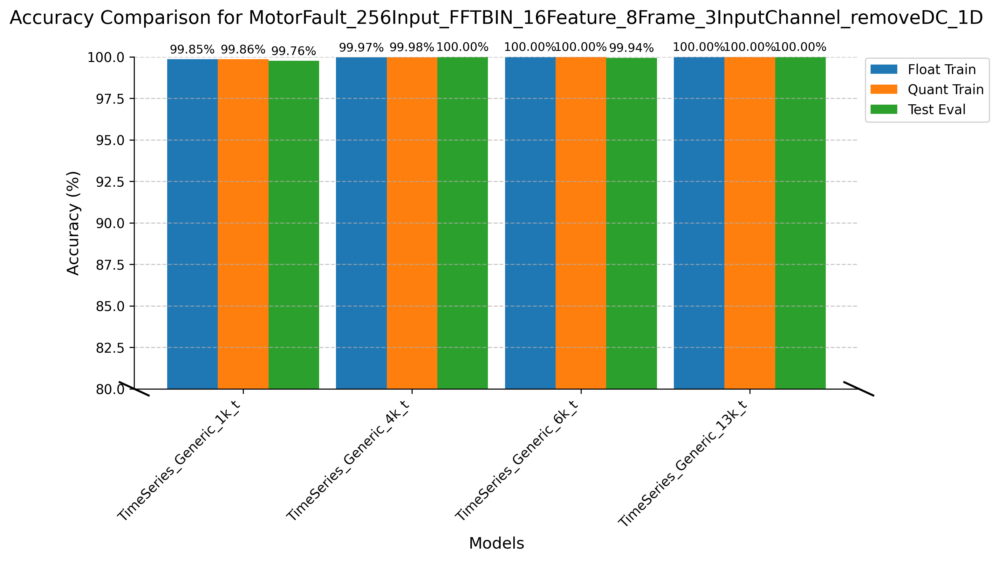
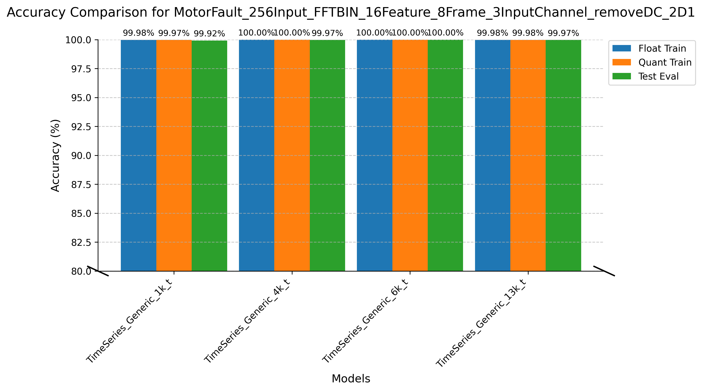
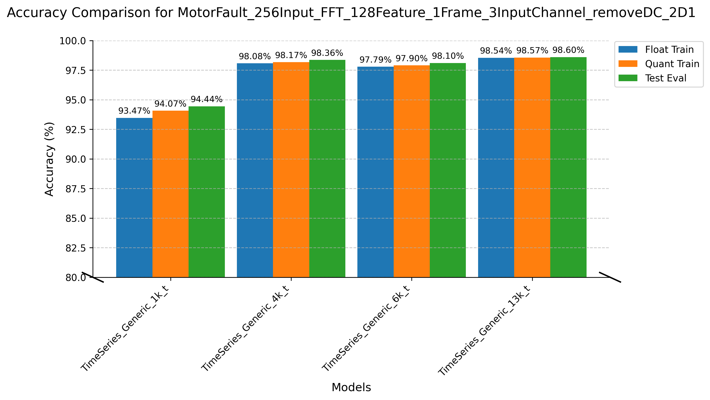
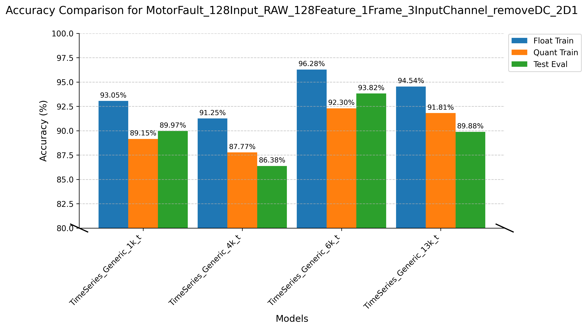
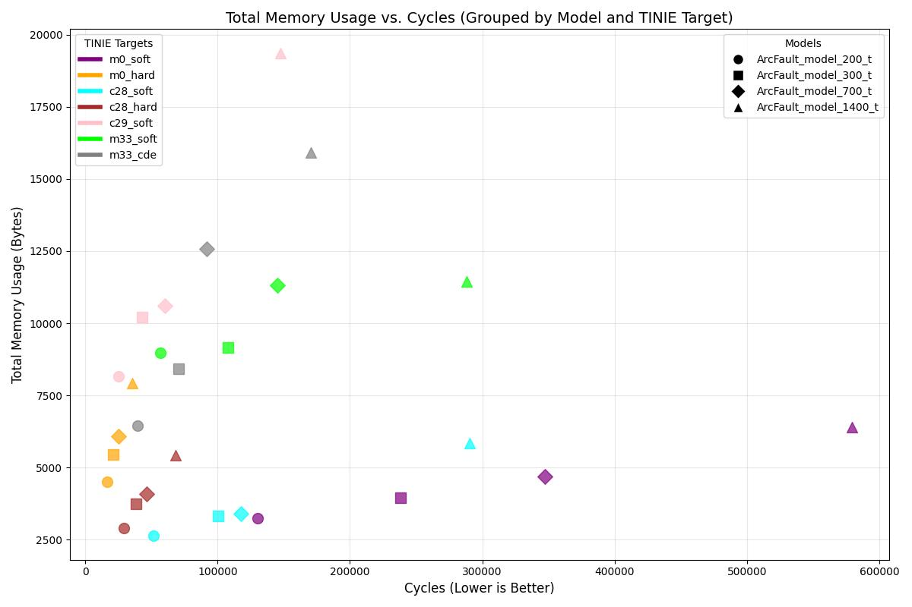
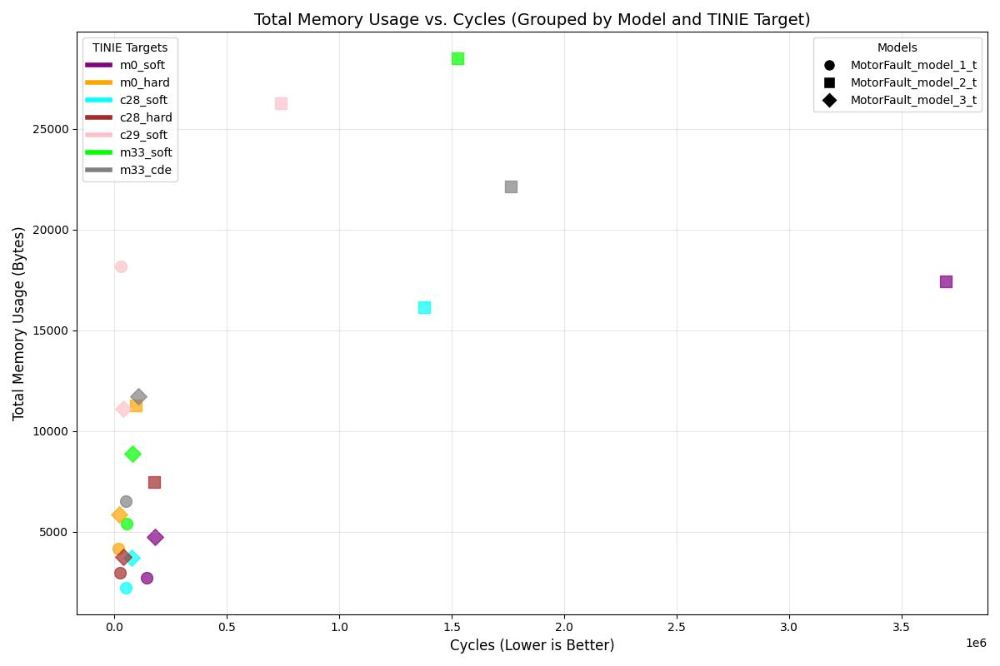
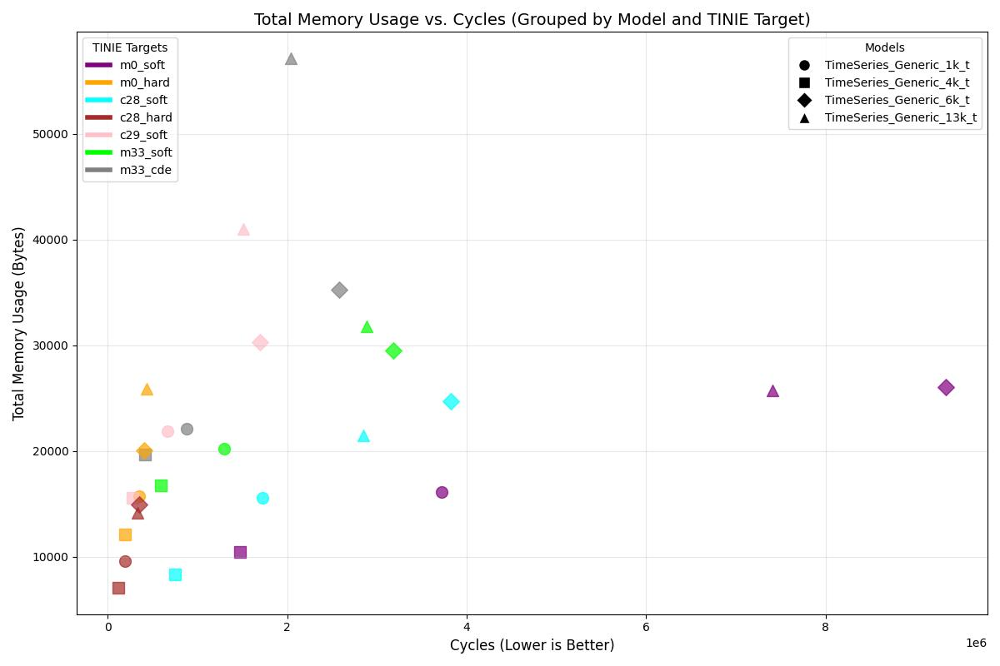

# Model Zoo: TI's Tiny Models for Microcontrollers

Welcome to the **Model Zoo**! 

This repository provides a curated collection of neural network models optimized for **embedded systems** and **low-power microcontrollers**. These models are designed for tasks such as **Classification**, **Regression**, and **Anomaly Detection**. All models are lightweight, efficient, and tailored to run smoothly on resource constrained devices. Select a task category to find models, their performance details, and use cases.

<b>Classification</b>

## Quick Comparison Table

Here's a quick side-by-side comparison of our available classification models based on their **target application**, **resource usage**, and **availability**:

| **Model**                  | **Suited For**                        | **Availability**      | **Total Parameters** | **Total MACs (M)** |
|----------------------------|----------------------------------------|-----------------------|-----------------------|--------------------|
| TimeSeries_Generic_1k      | Generic Time series tasks             | tinyml-modelmaker     | 970                   | 0.3                |
| TimeSeries_Generic_1k_t    | Generic Time series tasks             | tinyml-modelmaker     | 972                   | 0.3                |
| TimeSeries_Generic_4k      | Generic Time series tasks             | tinyml-modelmaker     | 3,682                 | 0.14               |
| TimeSeries_Generic_4k_t    | Generic Time series tasks             | tinyml-modelmaker     | 3,684                 | 0.14               |
| TimeSeries_Generic_6k      | Generic Time series tasks             | tinyml-modelmaker     | 5,186                 | 0.78               |
| TimeSeries_Generic_6k_t    | Generic Time series tasks             | tinyml-modelmaker     | 5,188                 | 0.78               |
| TimeSeries_Generic_13k     | Generic Time series tasks             | tinyml-modelmaker     | 12,978                | 0.67               |
| TimeSeries_Generic_13k_t   | Generic Time series tasks             | tinyml-modelmaker     | 12,980                | 0.67               |
| ArcFault_model_200_t       | Arc Fault Classification              | GUI                   | 296                   | 0.01               |
| ArcFault_model_300_t       | Arc Fault Classification              | GUI                   | 388                   | 0.02               |
| ArcFault_model_700_t       | Arc Fault Classification              | GUI                   | 844                   | 0.03               |
| ArcFault_model_1400_t      | Arc Fault Classification              | GUI                   | 0                     | 0                  |
| MotorFault_model_1_t       | Motor Bearing Fault Classification    | GUI                   | 588                   | 0.01               |
| MotorFault_model_2_t       | Motor Bearing Fault Classification    | GUI                   | 4,032                 | 0.47               |
| MotorFault_model_3_t       | Motor Bearing Fault Classification    | GUI                   | 0                     | 0                  |
---

### Notes:

- **Suited For**: It indicates the application the model was originally created for. However, you can use these models for other applications as well.

- **Availability**: 

  - **Generic Models**: These models are versatile and can be used for any type of time series classification task.  
  *They are available in the **tinyml-modelmaker**.*

  - **GUI-Specific Models**: These models are tailored for specific applications like **arc fault detection** and **motor fault classification**.  
  *They are TI proprietary models and are available only in the **GUI version**. They are also available on **tinyml-modelmaker**, and their model definitions are exposed, meaning they can be tweaked by the user.*

- **Total MACs**: This tells you how many multiply-accumulate operations the model performs during a single forward pass.

- The numbers in the table have all been measured for an input dimension of N,C,H,W of (1,1,512,1)

- The models with '_t' in their names are slightly tweaked for TI MCUs with Hardware NPU (Eg: F28P55). It is compulsory to use '_t' version models for F28P55. On other devices, there is no significant advantage if you use '_t' models or not.

---

## Comparing Models on Real World Datasets

### I. Accuracy Comparison

To help you compare models and have model complexity v/s accuracy comparison, we used two real-world datasets to test the models:

1. **Motor Fault Dataset** ([Dataset Link](http://software-dl.ti.com/C2000/esd/mcu_ai/01_00_00/datasets/motor_fault_classification_dsk.zip)) 
2. **Arc Fault Dataset**  ([Dataset Link](http://software-dl.ti.com/C2000/esd/mcu_ai/01_00_00/datasets/arc_fault_classification_dsi.zip))  

### Motor Fault Dataset

For the **Motor Fault Dataset**, we evaluate all **generic models** using four different feature extraction presets available for **motor fault bearing classification**. These presets are:

1. **MotorFault_256Input_FFTBIN_16Feature_8Frame_3InputChannel_removeDC_1D**
2. **MotorFault_256Input_FFTBIN_16Feature_8Frame_3InputChannel_removeDC_2D1**
3. **MotorFault_256Input_FFT_128Feature_1Frame_3InputChannel_removeDC_2D1**
4. **MotorFault_128Input_RAW_128Feature_1Frame_3InputChannel_removeDC_2D1**

*You can read more about the definitions of these presets in this [example readme](link_here).*

The table below shows the accuracies (float train, quant train, and test evaluation) for each model under each preset:

<table>
  <tr>
    <th rowspan="2" style="text-align:center;">Model</th>
    <th rowspan="2" style="text-align:center;">Parameters</th>
    <th colspan="3" style="text-align:center;">MotorFault_256Input_FFTBIN_16Feature_8Frame_3InputChannel_removeDC_1D</th>
    <th colspan="3" style="text-align:center;">MotorFault_256Input_FFTBIN_16Feature_8Frame_3InputChannel_removeDC_2D1</th>
    <th colspan="3" style="text-align:center;">MotorFault_256Input_FFT_128Feature_1Frame_3InputChannel_removeDC_2D1</th>
    <th colspan="3" style="text-align:center;">MotorFault_128Input_RAW_128Feature_1Frame_3InputChannel_removeDC_2D1</th>
  </tr>
  <tr>
    <th>Float Train Accuracy</th>
    <th>Quant Train Accuracy</th>
    <th>Test Evaluation Accuracy</th>
    <th>Float Train Accuracy</th>
    <th>Quant Train Accuracy</th>
    <th>Test Evaluation Accuracy</th>
    <th>Float Train Accuracy</th>
    <th>Quant Train Accuracy</th>
    <th>Test Evaluation Accuracy</th>
    <th>Float Train Accuracy</th>
    <th>Quant Train Accuracy</th>
    <th>Test Evaluation Accuracy</th>
  </tr>
  <tr>
    <td style="text-align:center;">TimeSeries_Generic_1k_t</td>
    <td style="text-align:center;">1k</td>
    <td style="text-align:center;">99.853%</td>
    <td style="text-align:center;">99.858%</td>
    <td style="text-align:center;">99.76%</td>
    <td style="text-align:center;">99.985%</td>
    <td style="text-align:center;">99.975%</td>
    <td style="text-align:center;">99.92%</td>
    <td style="text-align:center;">93.466%</td>
    <td style="text-align:center;">94.074%</td>
    <td style="text-align:center;">94.44%</td>
    <td style="text-align:center;">93.051%</td>
    <td style="text-align:center;">89.151%</td>
    <td style="text-align:center;">89.97%</td>
</tr>
<tr>
    <td style="text-align:center;">TimeSeries_Generic_4k_t</td>
    <td style="text-align:center;">4k</td>
    <td style="text-align:center;">99.970%</td>
    <td style="text-align:center;">99.980%</td>
    <td style="text-align:center;">100.00%</td>
    <td style="text-align:center;">99.995%</td>
    <td style="text-align:center;">99.995%</td>
    <td style="text-align:center;">99.97%</td>
    <td style="text-align:center;">98.077%</td>
    <td style="text-align:center;">98.166%</td>
    <td style="text-align:center;">98.36%</td>
    <td style="text-align:center;">91.254%</td>
    <td style="text-align:center;">87.769%</td>
    <td style="text-align:center;">86.38%</td>
</tr>
<tr>
    <td style="text-align:center;">TimeSeries_Generic_6k_t</td>
    <td style="text-align:center;">6k</td>
    <td style="text-align:center;">100.000%</td>
    <td style="text-align:center;">99.995%</td>
    <td style="text-align:center;">99.94%</td>
    <td style="text-align:center;">100.000%</td>
    <td style="text-align:center;">100.000%</td>
    <td style="text-align:center;">100.00%</td>
    <td style="text-align:center;">97.791%</td>
    <td style="text-align:center;">97.899%</td>
    <td style="text-align:center;">98.10%</td>
    <td style="text-align:center;">96.283%</td>
    <td style="text-align:center;">92.299%</td>
    <td style="text-align:center;">93.82%</td>
</tr>
<tr>
    <td style="text-align:center;">TimeSeries_Generic_13k_t</td>
    <td style="text-align:center;">14k</td>
    <td style="text-align:center;">100.000%</td>
    <td style="text-align:center;">100.000%</td>
    <td style="text-align:center;">100.00%</td>
    <td style="text-align:center;">99.985%</td>
    <td style="text-align:center;">99.985%</td>
    <td style="text-align:center;">99.97%</td>
    <td style="text-align:center;">98.542%</td>
    <td style="text-align:center;">98.567%</td>
    <td style="text-align:center;">98.60%</td>
    <td style="text-align:center;">94.543%</td>
    <td style="text-align:center;">91.810%</td>
    <td style="text-align:center;">89.88%</td>
</tr>
</table>

To help you visualize the above information, bar graphs are provided below for each preset. Each graph compares the **Float Train Accuracy**, **Quant Train Accuracy**, and **Test Evaluation Accuracy** for all models under the respective preset.

| **Preset 1**: MotorFault_256Input_FFTBIN_16Feature_8Frame_3InputChannel_removeDC_1D | **Preset 2**: MotorFault_256Input_FFTBIN_16Feature_8Frame_3InputChannel_removeDC_2D1 |
|-------------------------------------------------------------------------------------|-------------------------------------------------------------------------------------|
|                                     |                                     |

| **Preset 3**: MotorFault_256Input_FFT_128Feature_1Frame_3InputChannel_removeDC_2D1  | **Preset 4**: MotorFault_128Input_RAW_128Feature_1Frame_3InputChannel_removeDC_2D1  |
|-------------------------------------------------------------------------------------|-------------------------------------------------------------------------------------|
|                                     |                                     |

---

#### Key Insights:

- Presets 1, 2, and 3 involve FFT-based feature extraction, which simplifies the learning process for models and generally results in higher accuracy. Preset 4, on the other hand, uses raw feature extraction, making it a more realistic benchmark for model performance.

- Observing the 4th graph, we see that the `TimeSeries_Generic_6k_t` model achieves the highest accuracy under Preset 4, surpassing even the larger `TimeSeries_Generic_13k_t` model. Additionally, when using the 2nd feature extraction preset, the 6k model achieves 100% accuracy across all three metrics: float train, quant train, and test evaluation accuracy.

- Since Preset 4 is our benchmark, the `TimeSeries_Generic_6k_t` model stands out as the better choice overall compared to other models for this particular classification problem.

---

### Arc Fault Dataset

For the **Arc Fault Dataset**, we follow a similar approach. The models are evaluated using the four feature extraction presets Arc Fault Classification has. The presets are:

1. preset1
2. preset 2
3. preset 3
4. preset 4

(.........)

---

### II. Performance and Resource Utilization

### Overview of TINIE

TINIE (TI Neural Inference Engine) is a framework to run small, efficient neural networks on TI microcontrollers. It uses integer math and, when available, hardware acceleration to save power and memory.

#### TINIE Execution Types

| **Type**              | **Meaning**                                      |
|-----------------------|--------------------------------------------------|
| **Software TINIE**    | Runs on CPU using integer operations.            |
| **Hardware TINIE**    | Uses a special accelerator or CDE                |

---

#### Supported TINIE Targets

| **Target Name**          | **Platform**           | **Type**       |
|--------------------------|------------------------|----------------|
| `m0_soft_int_in_int_out` | Arm Cortex-M0          | Software       |
| `m0_hard_int_in_int_out` | Cortex-M0 + Accelerator| Hardware       |
| `c28_soft_int_in_int_out`| TI C28x DSP            | Software       |
| `c28_hard_int_in_int_out`| C28x + Accelerator     | Hardware       |
| `c29_soft_int_in_int_out`| TI C29x DSP            | Software       |
| `m33_soft_int_in_int_out`| Arm Cortex-M33         | Software       |
| `m33_cde_int_in_int_out` | Cortex-M33 + CDE       | Hardware       |

### Metrics Used for Comparison

| Metric              | Description                                                                                      |
|---------------------|--------------------------------------------------------------------------------------------------|
| **Cycles**          | Number of processor cycles required to run inference. Lower is better for performance.          |
| **Code Size (bytes)**| Memory occupied by executable code.                                              |
| **RO Data (bytes)** | Read only data size, including constants and weights stored in flash memory.                     |
| **RW Data (bytes)** | Read write data size, memory used during execution.                                      |
| **Total Bytes**     | Sum of code, RO data, and RW data , overall memory footprint.                                   |
| **Flash Usage**     | Sum of code and RO data , non-volatile memory usage.                                            |
| **SRAM Usage**      | RW data size , volatile memory used during runtime.                                             |

### Model Performance and Resource Table

| **Model**              | **TINIE Target**            | **Cycles** | **Code (bytes)** | **RO Data (bytes)** | **RW Data (bytes)** | **Total Bytes** | **Flash (bytes)** | **SRAM (bytes)** |
|-------------------------|-----------------------------|------------|------------------|---------------------|---------------------|-----------------|-------------------|------------------|
| MotorFault_model_1_t    | m0_soft_int_in_int_out      | 142067     | 952              | 752                 | 1024                | 2728            | 1704              | 1024             |
| MotorFault_model_1_t    | m0_hard_int_in_int_out      | 16831      | 1010             | 2236                | 916                 | 4162            | 3246              | 916              |
| MotorFault_model_1_t    | c28_soft_int_in_int_out     | 50830      | 571              | 643                 | 1016                | 2230            | 1214              | 1016             |
| MotorFault_model_1_t    | c28_hard_int_in_int_out     | 25354      | 800              | 1038                | 1112                | 2950            | 1838              | 1112             |
| MotorFault_model_1_t    | c29_soft_int_in_int_out     | 28179      | 16378            | 752                 | 1024                | 18154           | 17130             | 1024             |
| MotorFault_model_1_t    | m33_soft_int_in_int_out     | 55830      | 3642             | 752                 | 1024                | 5418            | 4394              | 1024             |
| MotorFault_model_1_t    | m33_cde_int_in_int_out      | 49626      | 4062             | 1072                | 1376                | 6510            | 5134              | 1376             |
| MotorFault_model_2_t    | m0_soft_int_in_int_out      | 3698626    | 2664             | 3872                | 10880               | 17416           | 6536              | 10880            |
| MotorFault_model_2_t    | m0_hard_int_in_int_out      | 94637      | 1334             | 6684                | 3252                | 11270           | 8018              | 3252             |
| MotorFault_model_2_t    | c28_soft_int_in_int_out     | 1375817    | 1611             | 3651                | 10872               | 16134           | 5262              | 10872            |
| MotorFault_model_2_t    | c28_hard_int_in_int_out     | 178527     | 970              | 3292                | 3198                | 7460            | 4262              | 3198             |
| MotorFault_model_2_t    | c29_soft_int_in_int_out     | 740243     | 11532            | 3872                | 10880               | 26284           | 15404             | 10880            |
| MotorFault_model_2_t    | m33_soft_int_in_int_out     | 1527162    | 13738            | 3872                | 10880               | 28490           | 17610             | 10880            |
| MotorFault_model_2_t    | m33_cde_int_in_int_out      | 1762990    | 9548             | 7968                | 4608                | 22124           | 17516             | 4608             |
| MotorFault_model_3_t    | m0_soft_int_in_int_out      | 179145     | 2132             | 1952                | 672                 | 4756            | 4084              | 672              |
| MotorFault_model_3_t    | m0_hard_int_in_int_out      | 22974      | 1286             | 3636                | 932                 | 5854            | 4922              | 932              |
| MotorFault_model_3_t    | c28_soft_int_in_int_out     | 75270      | 1530             | 1539                | 656                 | 3725            | 3069              | 656              |
| MotorFault_model_3_t    | c28_hard_int_in_int_out     | 39528      | 941              | 1702                | 1116                | 3759            | 2643              | 1116             |
| MotorFault_model_3_t    | c29_soft_int_in_int_out     | 37994      | 8486             | 1952                | 672                 | 11110           | 10438             | 672              |
| MotorFault_model_3_t    | m33_soft_int_in_int_out     | 78771      | 6236             | 1952                | 672                 | 8860            | 8188              | 672              |
| MotorFault_model_3_t    | m33_cde_int_in_int_out      | 106876     | 7232             | 3104                | 1408                | 11744           | 10336             | 1408             |
| ArcFault_model_200_t    | m0_soft_int_in_int_out      | 130223     | 1780             | 432                 | 1040                | 3252            | 2212              | 1040             |
| ArcFault_model_200_t    | m0_hard_int_in_int_out      | 16650      | 1338             | 2268                | 900                 | 4506            | 3606              | 900              |
| ArcFault_model_200_t    | c28_soft_int_in_int_out     | 51799      | 1184             | 435                 | 1026                | 2645            | 1619              | 1026             |
| ArcFault_model_200_t    | c28_hard_int_in_int_out     | 29020      | 880              | 1170                | 858                 | 2908            | 2050              | 858              |
| ArcFault_model_200_t    | c29_soft_int_in_int_out     | 24915      | 6694             | 432                 | 1040                | 8166            | 7126              | 1040             |
| ArcFault_model_200_t    | m33_soft_int_in_int_out     | 56519      | 7506             | 432                 | 1040                | 8978            | 7938              | 1040             |
| ArcFault_model_200_t    | m33_cde_int_in_int_out      | 39327      | 4832             | 576                 | 1048                | 6456            | 5408              | 1048             |
| ArcFault_model_300_t    | m0_soft_int_in_int_out      | 238404     | 1838             | 560                 | 1552                | 3950            | 2398              | 1552             |
| ArcFault_model_300_t    | m0_hard_int_in_int_out      | 21269      | 1338             | 2476                | 1644                | 5458            | 3814              | 1644             |
| ArcFault_model_300_t    | c28_soft_int_in_int_out     | 100332     | 1282             | 515                 | 1538                | 3335            | 1797              | 1538             |
| ArcFault_model_300_t    | c28_hard_int_in_int_out     | 38202      | 880              | 1274                | 1606                | 3760            | 2154              | 1606             |
| ArcFault_model_300_t    | c29_soft_int_in_int_out     | 42968      | 8088             | 560                 | 1552                | 10200           | 8648              | 1552             |
| ArcFault_model_300_t    | m33_soft_int_in_int_out     | 108050     | 7046             | 560                 | 1552                | 9158            | 7606              | 1552             |
| ArcFault_model_300_t    | m33_cde_int_in_int_out      | 70614      | 6054             | 784                 | 1576                | 8414            | 6838              | 1576             |
| ArcFault_model_700_t    | m0_soft_int_in_int_out      | 347458     | 2096             | 1056                | 1552                | 4704            | 3152              | 1552             |
| ArcFault_model_700_t    | m0_hard_int_in_int_out      | 25261      | 1338             | 3108                | 1644                | 6090            | 4446              | 1644             |
| ArcFault_model_700_t    | c28_soft_int_in_int_out     | 117877     | 983              | 883                 | 1538                | 3404            | 1866              | 1538             |
| ArcFault_model_700_t    | c28_hard_int_in_int_out     | 46215      | 878              | 1614                | 1606                | 4098            | 2492              | 1606             |
| ArcFault_model_700_t    | c29_soft_int_in_int_out     | 60153      | 7988             | 1056                | 1552                | 10596           | 9044              | 1552             |
| ArcFault_model_700_t    | m33_soft_int_in_int_out     | 145336     | 8698             | 1056                | 1552                | 11306           | 9754              | 1552             |
| ArcFault_model_700_t    | m33_cde_int_in_int_out      | 91920      | 9400             | 1600                | 1576                | 12576           | 11000             | 1576             |
| ArcFault_model_1400_t   | m0_soft_int_in_int_out      | 579321     | 2180             | 1936                | 2280                | 6396            | 4116              | 2280             |
| ArcFault_model_1400_t   | m0_hard_int_in_int_out      | 35332      | 1338             | 4176                | 2408                | 7922            | 5514              | 2408             |
| ArcFault_model_1400_t   | c28_soft_int_in_int_out     | 290613     | 1813             | 1763                | 2280                | 5856            | 3576              | 2280             |
| ArcFault_model_1400_t   | c28_hard_int_in_int_out     | 68180      | 876              | 2172                | 2370                | 5418            | 3048              | 2370             |
| ArcFault_model_1400_t   | c29_soft_int_in_int_out     | 147500     | 15138            | 1936                | 2280                | 19354           | 17074             | 2280             |
| ArcFault_model_1400_t   | m33_soft_int_in_int_out     | 288124     | 7228             | 1936                | 2280                | 11444           | 9164              | 2280             |
| ArcFault_model_1400_t   | m33_cde_int_in_int_out      | 170529     | 10508            | 3136                | 2280                | 15924           | 13644             | 2280             |
| TimeSeries_Generic_1k_t | m0_soft_int_in_int_out      | 3725652    | 2082             | 1776                | 12320               | 16178           | 3858              | 12320            |
| TimeSeries_Generic_1k_t | m0_hard_int_in_int_out      | 349653     | 1598             | 3732                | 10416               | 15746           | 5330              | 10416            |
| TimeSeries_Generic_1k_t | c28_soft_int_in_int_out     | 1725188    | 1962             | 1280                | 12320               | 15562           | 3242              | 12320            |
| TimeSeries_Generic_1k_t | c28_hard_int_in_int_out     | 195676     | 1368             | 1972                | 6250                | 9590            | 3340              | 6250             |
| TimeSeries_Generic_1k_t | c29_soft_int_in_int_out     | 669310     | 7824             | 1776                | 12320               | 21920           | 9600              | 12320            |
| TimeSeries_Generic_1k_t | m33_soft_int_in_int_out     | 1300325    | 6114             | 1776                | 12320               | 20210           | 7890              | 12320            |
| TimeSeries_Generic_1k_t | m33_cde_int_in_int_out      | 883383     | 9228             | 2512                | 10384               | 22124           | 11740             | 10384            |
| TimeSeries_Generic_4k_t | m0_soft_int_in_int_out      | 1473033    | 2338             | 5184                | 2976                | 10498           | 7522              | 2976             |
| TimeSeries_Generic_4k_t | m0_hard_int_in_int_out      | 195162     | 1658             | 7724                | 2736                | 12118           | 9382              | 2736             |
| TimeSeries_Generic_4k_t | c28_soft_int_in_int_out     | 752342     | 2193             | 4240                | 1936                | 8369            | 6433              | 1936             |
| TimeSeries_Generic_4k_t | c28_hard_int_in_int_out     | 117686     | 1414             | 3986                | 1690                | 7090            | 5400              | 1690             |
| TimeSeries_Generic_4k_t | c29_soft_int_in_int_out     | 277084     | 7424             | 5184                | 2976                | 15584           | 12608             | 2976             |
| TimeSeries_Generic_4k_t | m33_soft_int_in_int_out     | 596086     | 8628             | 5184                | 2976                | 16788           | 13812             | 2976             |
| TimeSeries_Generic_4k_t | m33_cde_int_in_int_out      | 420317     | 7728             | 8432                | 3488                | 19648           | 16160             | 3488             |
| TimeSeries_Generic_6k_t | m0_soft_int_in_int_out      | 9343020    | 2666             | 6960                | 16416               | 26042           | 9626              | 16416            |
| TimeSeries_Generic_6k_t | m0_hard_int_in_int_out      | 408087     | 1798             | 9832                | 8436                | 20066           | 11630             | 8436             |
| TimeSeries_Generic_6k_t | c28_soft_int_in_int_out     | 3828374    | 2462             | 5840                | 16416               | 24718           | 8302              | 16416            |
| TimeSeries_Generic_6k_t | c28_hard_int_in_int_out     | 348174     | 1524             | 5058                | 8364                | 14946           | 6582              | 8364             |
| TimeSeries_Generic_6k_t | c29_soft_int_in_int_out     | 1693785    | 6918             | 6960                | 16416               | 30294           | 13878             | 16416            |
| TimeSeries_Generic_6k_t | m33_soft_int_in_int_out     | 3186844    | 6186             | 6960                | 16416               | 29562           | 13146             | 16416            |
| TimeSeries_Generic_6k_t | m33_cde_int_in_int_out      | 2579155    | 11110            | 11648               | 12512               | 35270           | 22758             | 12512            |
| TimeSeries_Generic_13k_t | m0_soft_int_in_int_out     | 7405900    | 3652             | 16704               | 5408                | 25764           | 20356             | 5408             |
| TimeSeries_Generic_13k_t | m0_hard_int_in_int_out     | 432214     | 2044             | 18480               | 5376                | 25900           | 20524             | 5376             |
| TimeSeries_Generic_13k_t | c28_soft_int_in_int_out    | 2847296    | 2991             | 14352               | 4160                | 21503           | 17343             | 4160             |
| TimeSeries_Generic_13k_t | c28_hard_int_in_int_out    | 328913     | 1512             | 9454                | 3218                | 14184           | 10966             | 3218             |
| TimeSeries_Generic_13k_t | c29_soft_int_in_int_out    | 1508205    | 18942            | 16704               | 5408                | 41054           | 35646             | 5408             |
| TimeSeries_Generic_13k_t | m33_soft_int_in_int_out    | 2887600    | 9658             | 16704               | 5408                | 31770           | 26362             | 5408             |
| TimeSeries_Generic_13k_t | m33_cde_int_in_int_out     | 2045094    | 21776            | 28656               | 6720                | 57152           | 50432             | 6720             |

### Graphical Insights for Model Selection

1. **Trade-off: Cycles and Total Memory Usage**
   This plot visualizes the trade-off between computational speed (cycles) and total memory footprint. A model with low cycles is faster but might use more memory. A model with low memory usage is more memory-efficient but might be slower. So our goal is to identify models that balance both speed and memory efficiency, ideally those near the bottom-left corner of the plot (low cycles and low memory usage).

<table align="center">
  <tr>
    <td align="center">
      
       <b>Arc Fault Classification GUI Models</b>
    </td>
  </tr>
  <tr>
    <td align="center">
      
       <b>Motor Fault Classification GUI Models</b>
    </td>
  </tr>
  <tr>
    <td align="center">
      
       <b>Generic Timeseries Classification Models</b>
    </td>
  </tr>
</table>

2. **Flash and SRAM Usage by Model** 
   The graph shows how memory is allocated between flash and SRAM for each model.

<b>Regression</b>

**Coming Soon!**

<b>Anomaly Detection</b>

**Coming Soon!**

