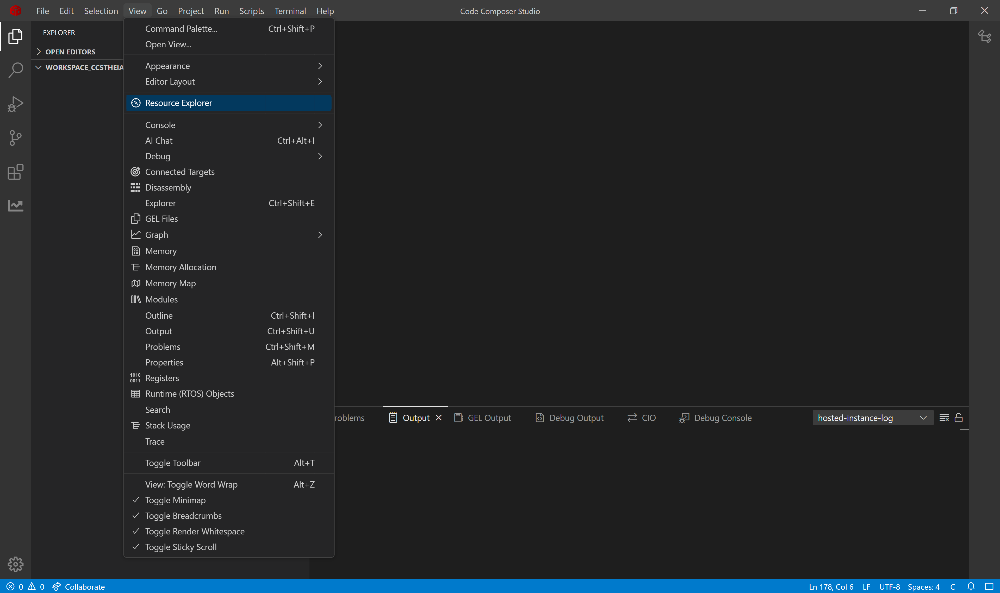
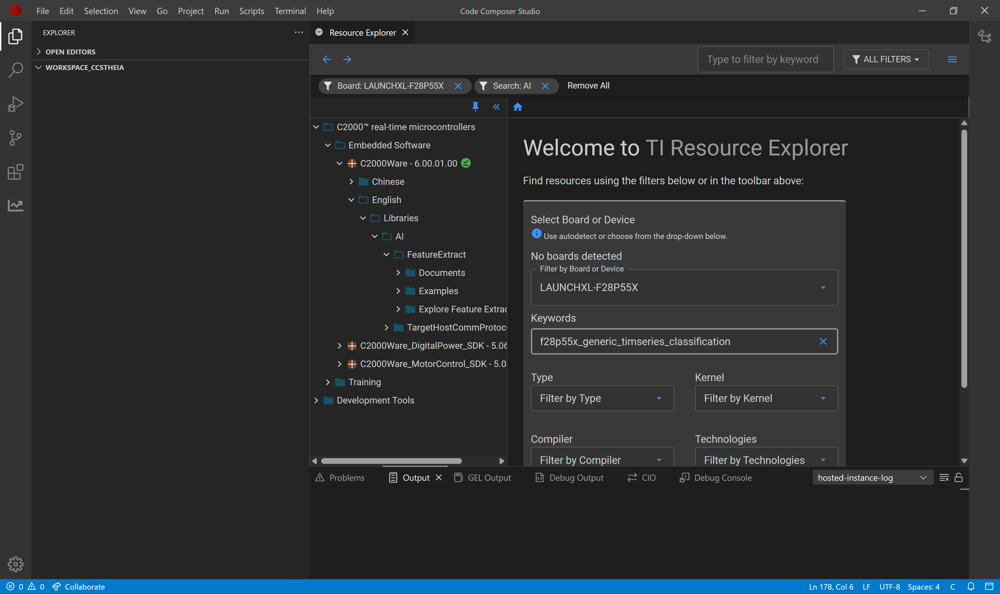
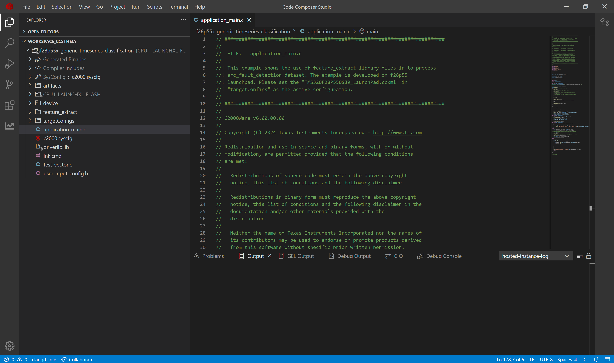
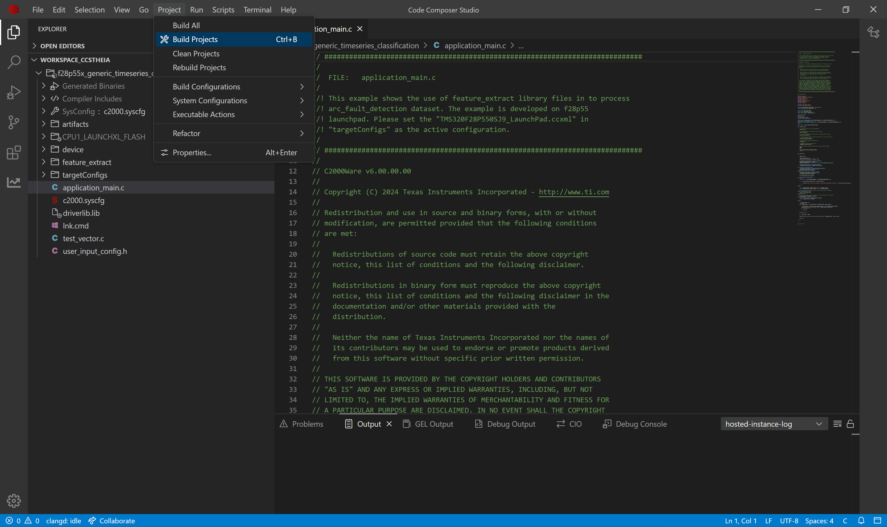
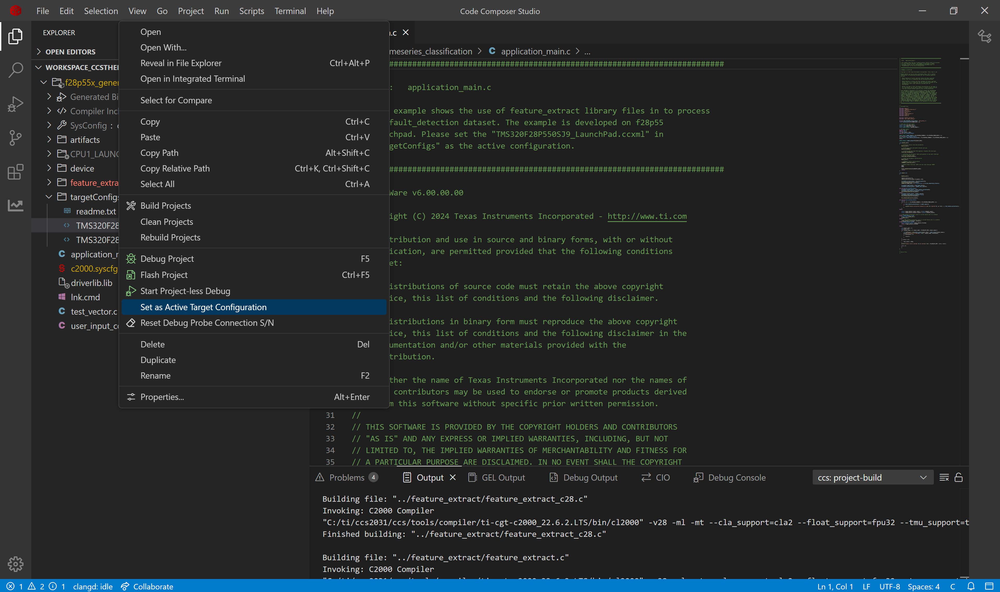
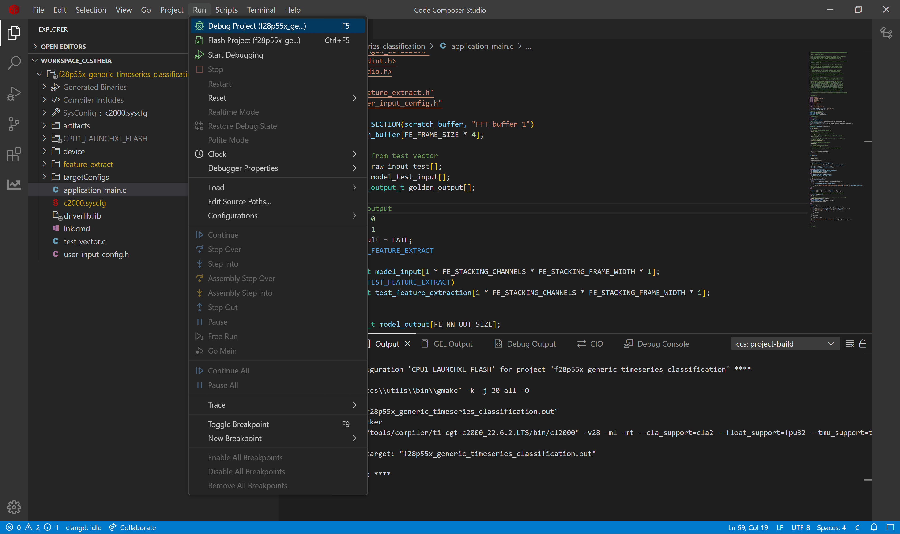
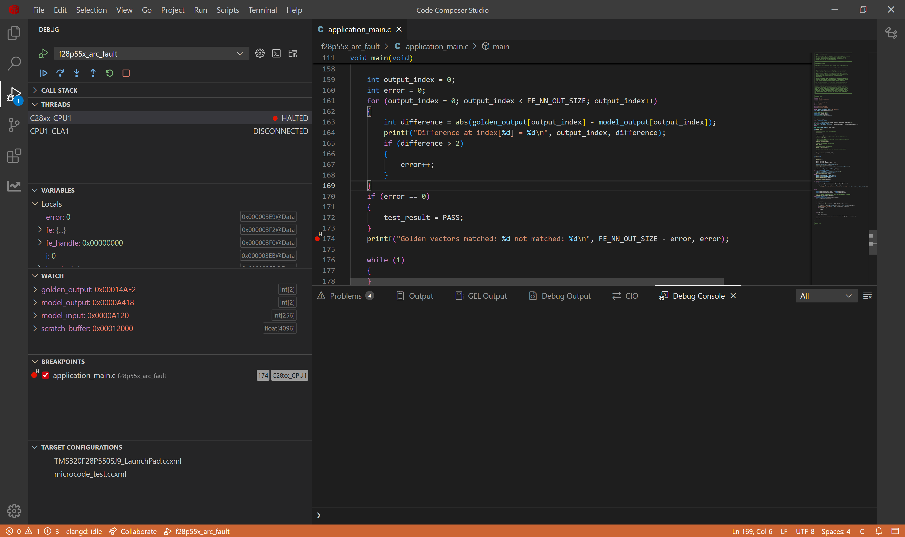
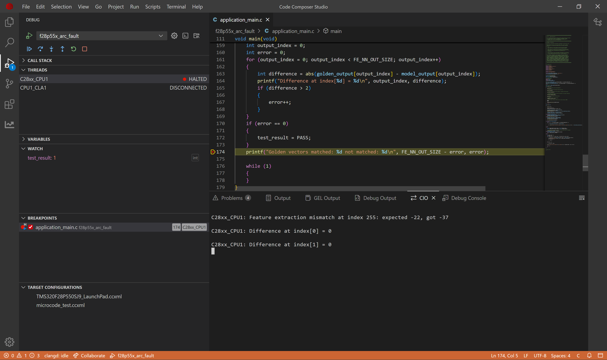

# Project Compilation Guide: Timeseries Classification Examples

## Overview

This guide explains how any classification example from tinyml-modelzoo can be used on an MCU. We will understand the outputs from the modelzoo and their meaning. We will see how a generic timeseries classification project looks like. The guide will explain how to use the outputs from modelzoo in the CCS Project and finally run it on the device.

## Output from Modelzoo

Modelzoo will start by loading the dataset, train the model, test the model, compile the model. Modelzoo will create the output folder in `tinyml-modelmaker/data/projects/{dataset_name}`. You can find the dataset name in the [configuration](config.yaml) yaml. Let's assume the dataset_name to be generic_timeseries_classification.

```bash
cd tinyml-Modelzoo
run_tinyml_modelzoo.sh examples/hello_world/config.yaml
```

The example project has four useful file outputs by ModelMaker. We will see their name and meaning.
- `mod.a`: The ONNX model is compiled by tvm to get C files, which are converted into a single mod.a that can run on device. This file stores the core functionality of AI model.
- `tvmgen_default.h`: Mod.a exposes few APIs to interact with model which are present here. You can use these APIs in your application to run model

- `test_vector.c`: ModelMaker gives a test dataset and the expected output. You can use the model to inference this test dataset and check if the output is matching. 
- `user_input_config.h`: This configuration file has preprocessing flag definitions for the parameters used for feature extraction.

These 4 files can be used in a CCS Project to perform AI on edge.

## How to run on device

### CCS Studio

Code Composer Studio (CCS) is a free integrated development environment (IDE) provided by Texas Instruments (TI) for developing and debugging applications for TI's micro-controllers and processors. It offers various examples for users to get started with their problem statement. One of the application is f28p55x_generic_timseries_classification. We will use this example to run on device.

### Requirements

The CCS example *f28p55x_generic_timseries_classification* requires 4 files from modelmaker. We will copy the files from modelmaker run to the CCS example project. 

1. C2000Ware 6.01.00.00
2. Location of example: *C:\ti\c2000\C2000Ware_6_01_00_00\libraries\ai\examples\generic_timeseries_classification\f28p55x*

## Running for Target Device

After run the modelmaker from command line is finished. Copy the 4 files (path present below) from Modelmaker to CCS Project. Build the CCS Project, flash the program and start debugging the application. Check for the variable *error* for different sets of test cases preset in test_vector.c.

### Compiled model files

- mod.a: The compiled model is present in this file. 
  - Path Modelmaker: *tinyml-modelmaker/data/projects/wisdm_example/run/{date-time}/{model}/compilation/artifacts/mod.a*
  - Path CCS Project: *f28p55x_generic_timseries_classification/artifacts/mod.a*
- tvmgen_default.h: Header file to access the model inference APIs from mod.a 
  - Path Modelmaker: *tinyml-modelmaker/data/projects/wisdm_example/run/{date-time}/{model}/compilation/artifacts/tvmgen_default.h*
  - Path CCS Project: *f28p55x_generic_timseries_classification/artifacts/tvmgen_default.h*

### Test data for device verification

- test_vector.c: Test cases to check if the model works on device currently
  - Path Modelmaker: *tinyml-modelmaker/data/projects/wisdm_example/run/{date-time}/{model}/training/quantization/golden_vectors/test_vector.c*
  - Path CCS Project: *f28p55x_generic_timseries_classification/test_vector.c*
- user_input_config.h: Configuration of feature extraction library in SDK. 
  - Path Modelmaker: *tinyml-modelmaker/data/projects/wisdm_example/run/{date-time}/{model}/training/quantization/golden_vectors/user_input_config.h*
  - Path CCS Project: *f28p55x_generic_timseries_classification/user_input_config.h*

## Load sample example

We will load the generic timeseries example for f28p55 device using Code Composer Studio.

1. Open Code Composer Studio
2. Go to View tab -> Open Resource Explorer

3. Type the Board or Device to filter as **LAUNCHXL-F28P55X**
4. Type keyword as **f28p55x_generic_timseries_classification**

5. Select the folder **f28p55x_generic_timseries_classification** and click Import
6. Download and install the required dependencies of the project.
7. The imported project will look like this in the CCS Project


## Run the sample example

We will build the project and flash the program in device. The project has a 'C' file application_main.c, which contains the code for calling APIs to the feature extraction lib and model inference. We will use debug mode to see the result of model inference present in *test_result*.

8. Now we will build the project. Go to Project Tab -> Select Build Project(s)

9. Switch the active target device from **TMS320F28P550SJ9.ccxml** to **TMS320F28P550SJ9_LaunchPad.ccxml**.

10. Connect launchpad F28P55x to your system.
11. Flash the built project in device with debug mode. Go to Run tab -> Select Debug Project

12. After the application is flashed, debug screen will appear. Select the debug icon.

13. Place a breakpoint at the following line.

14. Continue the program and add the following variable in Watch section of debug

15. If the test_result is 1 it means the model inference is working correctly, if it is 0, the model inference is wrong.


## TLDR

- Run modelzoo using **run_tinyml_modelzoo examples/hello_world/config.yaml**
- Copy the file from modelmaker run folder to the CCS project
- Build the application
- Flash application using Debug
